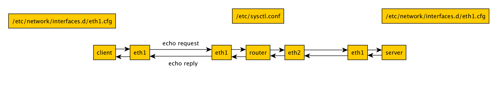

# Internal Networking

> Practice setting up a virtual private network



## Usage example

```
vagrant up
vagrant ssh client -c 'ping -c 1 server'
PING server (192.168.2.2) 56(84) bytes of data.
64 bytes from server (192.168.2.2): icmp_seq=1 ttl=63 time=0.799 ms

--- server ping statistics ---
1 packets transmitted, 1 received, 0% packet loss, time 0ms
rtt min/avg/max/mdev = 0.799/0.799/0.799/0.000 ms
```

Notice the time to live (ttl) is 63 instead of 64 because the request traveled through the router.

## Links

* https://www.vagrantup.com/docs/virtualbox/networking.html
* [Internal Network of Linux Machines on VirtualBox](https://youtu.be/qso9Wy875ek)

